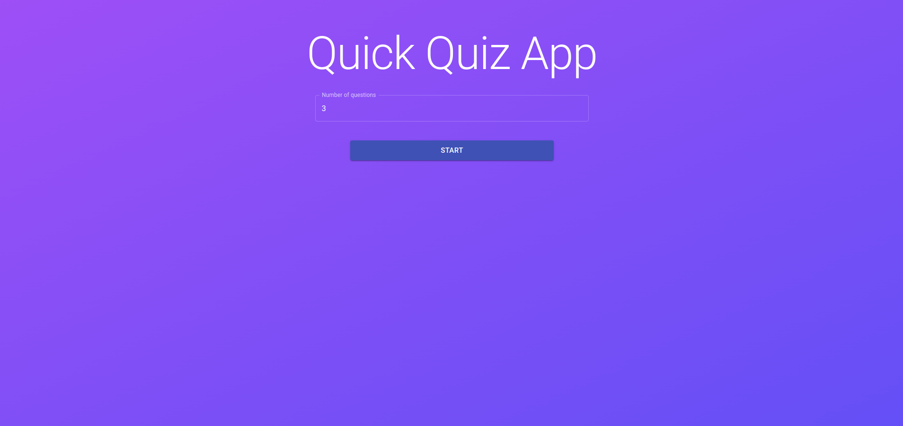
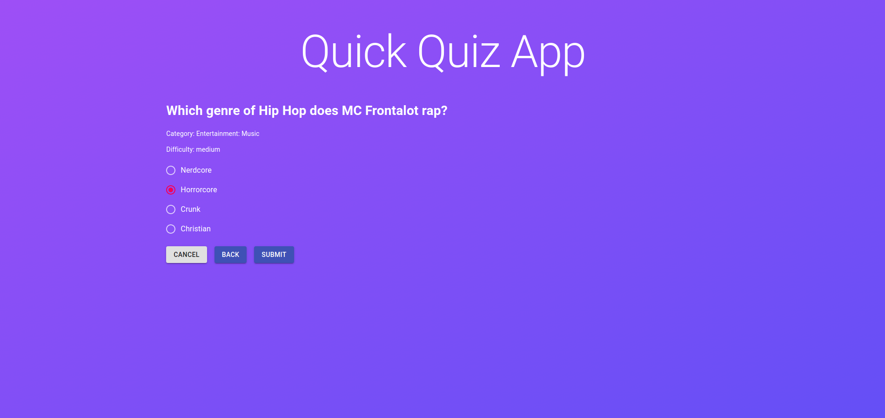

## 👁️‍🗨️ **Preview**





---

## 💅🏻 **Acesse o Quiz**

Você pode acessar a aplicação através [desse link](https://quiz-app-hba6dsi78-rafael-angonese.vercel.app/).

---

## 📄 **Descrição**

- Imagine que você foi contratado para desenvolver uma aplicação WEB para responder questionários de perguntas sobre conhecimentos gerais. Ao acessar a página, o usuário deve escolher a quantidade de perguntas que deseja responder. Após escolher, deve aparecer uma página com dois botões, “Start” e “Cancel”. Ao selecionar “Cancel”, deve retornar para escolher a quantidade. Ao selecionar “Start” deve fazer requisição na URL disponibilizada, pegar as perguntas e a cada pergunta, deve exibir as respostas. O usuário deve escolher uma resposta e a cada resposta deve contabilizar quantidade de acertos e erros. Ao final, deve vir um relatório com a quantidade de acertos e erros e uma lista de cada questão e qual foi certo e qual foi errado. Nessa lista também deve aparecer a resposta escolhida e a resposta correta. A pontuação deve ser guardada em no localStorage. Na primeira página e se houver um questionário salvo no localStorage, deve ter a possibilidade de rever o relatório.

- Requisitos não funcionais:
- É obrigatório a utilização do framework React, Material UI e usar a URL para gerar as questões através do link: https://opentdb.com/api.php?amount=QUANTIDADE.

- Além disso, usar o LocalStorage para armazenar, git para realizar a versão e github para armazenar o projeto.

- Requisitos não obrigatórios

- Você será bem avaliado se usar Context API, Axios, Hooks, Formik, testes de comportamento e se você realizar um deploy em algum link. Além disso, vamos dar uma atenção maior quando demonstrar uma boa apresentação de design e uso de design patterns (como services, repositories, factories, builders e etc)

---

## 🧪 **Tecnologias**

Esse projeto foi desenvolvido com as seguintes tecnologias:

- [Next.js](https://nextjs.org/)
- [TypeScript](https://www.typescriptlang.org/)
- [MaterialUI](https://material-ui.com/)
- [Formik](https://formik.org/)
- [Axios](https://github.com/axios/axios)

---

## 🎮 **Ambiente de desenvolvimento**

```bash
node --version
v16.0.0
```

---

## **🚀 Como executar**

```bash
# Clone este repositório.
$ git clone https://github.com/rafael-angonese/quiz-app

# Vá para a pasta quiz-app
$ cd quiz-app

# Instale as dependências
$ npm install

# Execute a aplicação
$ npm run dev
```

- O app estará rodando na porta 3000 no seu browser.
- Acesse [`<http://localhost:3000>`](http://localhost:3000)

---

## ⚖️ **Licença**

Esse projeto está sob a licença MIT. Veja o arquivo [LICENSE](LICENSE.md) para mais detalhes.

---

Feito com 💜 by Rafael Angonese
